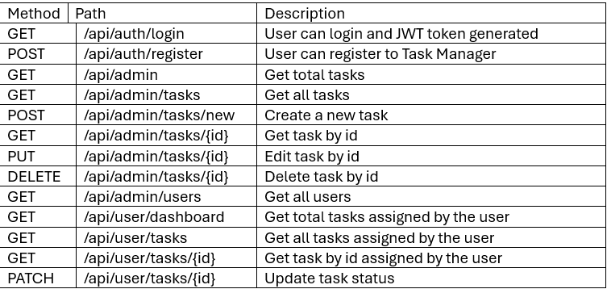

# Task Manager
A full-stack task management app built that let users to create, assign, and update tasks. The following stacks used:
### Frontend:
- React
- Tailwind CSS

### Backend:
- Java
- Spring Boot
- PostgreSQL
- Basic JWT

## Installation
Git clone both repository

Frontend: https://github.com/wonganjatan/task-manager-frontend
```bash
npm install
npm run dev
```

Backend: https://github.com/wonganjatan/task-manager
```bash
./mvnw spring-boot:run
```

## Usage
- This app open a local server to `http://localhost:5173` 
- User can login and register
- For Admin: can create, assign task to users, edit, and delete tasks
- For User: can only view tasks only assigned to them and update the task status
- Both users can use the filter function to find their desired tasks

## API Endpoints


## Tools
- Git
- VS Code for Frontend
- IntelliJ for Backend
- Windows Subsystem for Linux (WSL)
- React
- Tailwind css
- npm
- Java
- Spring Boot
- Maven
- PostgreSQL
- Basic JWT